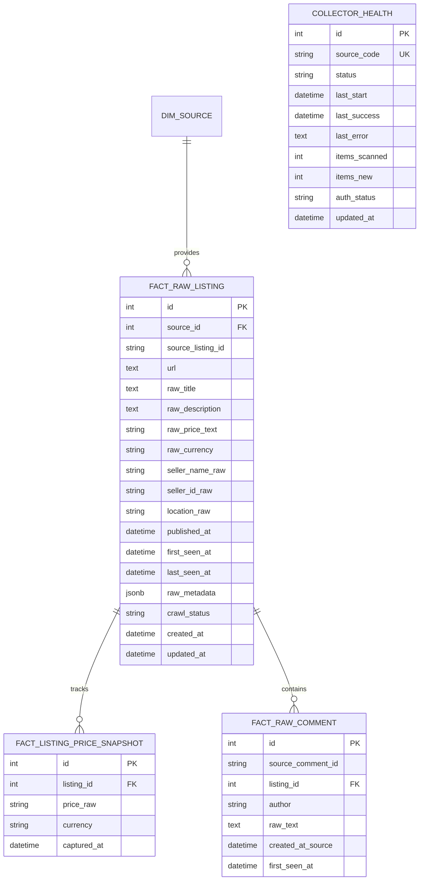

# BÁO CÁO NGHIỆM THU PHASE 1: RAW MARKET DATA COLLECTION

> **Dự án:** Market Price Intelligence Platform (Forked & Custom từ `devoidx/price-tracker`)  
> **Giai đoạn:** Phase 1 – Raw Market Data Collection  
> **Thời điểm hoàn thành:** 2026-10-07  
> **Trạng thái:** ✅ **HOÀN THÀNH TOÀN DIỆN (PASS ALL 22/22 TESTS)**

---

## 1. TỔNG QUAN VÀ CHIẾN LƯỢC KIẾN TRÚC

### 1.1. Đánh giá mã nguồn kế thừa (Review Existing Scraper & Scheduler)

Trước khi triển khai Phase 1, toàn bộ hạ tầng thu thập và lập lịch hiện tại đã được rà soát:

1. **`scraper.py`**:
   - *Cơ chế:* Sử dụng Playwright đồng bộ (`sync_playwright`), nhận vào 1 URL đơn lẻ của sản phẩm đã biết (Amazon, BestBuy, eBay, Target, Walmart), điều hướng và trích xuất giá qua selector CSS/XPath cấu hình sẵn.
   - *Mục đích thiết kế ban đầu:* Phục vụ tính năng cá nhân "theo dõi một đường link cố định" (Personal Price Tracker), không được thiết kế cho việc crawl danh sách marketplace theo từ khóa (feeds/listings) hoặc xử lý luồng mạng xã hội (Facebook Groups).
2. **`scheduler.py`**:
   - Sử dụng `BackgroundScheduler` của `APScheduler` với `SQLAlchemyJobStore` lưu job vào PostgreSQL.
   - Khởi chạy vòng lặp kiểm tra định kỳ cho từng URL sản phẩm cá nhân.
3. **Mô hình Dữ liệu cũ (`models.py`)**:
   - `Product` 1-1 với `Source` qua bảng `sources` (chỉ gồm `url`, `css_selector`, `current_price`).
   - `PriceHistory` lưu vết lịch sử giá của từng link cố định.

### 1.2. Quyết định: EXTEND (Mở rộng kiến trúc) thay vì REFACTOR hoặc Rewrite

* **Lựa chọn:** **EXTEND** (Không tạo crawler framework thứ hai, không làm xáo trộn mã nguồn baseline).
* **Lý do kỹ thuật:**
  1. Giữ nguyên khả năng tương thích ngược của `scraper.py` cho các tính năng theo dõi URL đơn lẻ của người dùng cá nhân (Single URL Trackers).
  2. Xây dựng package chuyên biệt `app/collectors/` kế thừa hạ tầng browser context của Playwright nhưng chuyên biệt hóa cho nghiệp vụ thu thập dữ liệu thị trường diện rộng (Multi-listing Feeds & Social Feeds).
  3. Tích hợp trực tiếp các Collector mới vào cùng engine `APScheduler` hiện hữu, tận dụng cùng connection pool và database session.

---

## 2. THIẾT KẾ KIẾN TRÚC BỘ THU THẬP (COLLECTOR ARCHITECTURE)

Hệ thống Collector được tổ chức dạng Module theo mô hình Factory & Strategy:

```
backend/app/collectors/
├── base.py                   # Contract chuẩn BaseCollector
├── goofish.py                # Collector Goofish (闲鱼)
├── chotot.py                 # Collector Chợ Tốt (Gateway API + Browser fallback)
├── facebook_marketplace.py   # Collector Facebook Marketplace
├── facebook_group.py         # Collector Facebook Groups & Comments
├── models.py                 # Database models cho Raw Data Layer
└── service.py                # Service điều phối, Registry & APScheduler Integration
```

### 2.1. Collector Contract (`BaseCollector`)

Tất cả Collector kế thừa từ [BaseCollector](file:///c:/Users/tuanlm2/Documents/market_price/backend/app/collectors/base.py) và tuân thủ hợp đồng chung:

| Method | Vai trò |
| :--- | :--- |
| `fetch(query)` | Tải raw payload từ nền tảng (HTTP request hoặc Playwright persistent browser context). |
| `parse(raw_data)` | Chuẩn hóa cấu trúc danh sách, **bảo toàn 100% nội dung thô** (raw title, raw price, location, seller). Không AI normalize. |
| `persist(parsed_items, db)` | Thực hiện ghi dữ liệu an toàn: **Deduplication**, cập nhật `last_seen_at`, ghi `price snapshot` khi phát hiện biến động giá, lưu vết comments. |
| `update_health(...)` | Cập nhật tình trạng hoạt động và trạng thái xác thực vào bảng `collector_health`. |
| `run(db, query)` | Template method thực thi toàn bộ chu trình với cơ chế bắt lỗi và cập nhật trạng thái tự động. |

---

## 3. CHI TIẾT CÁC COLLECTOR NỀN TẢNG

### 3.1. Goofish / 闲鱼 (`GoofishCollector`)
- **Mã nguồn:** `GOOFISH`
- **Tiền tệ mặc định:** `CNY`
- **Tần suất lập lịch:** 10 phút (`COLLECTOR_INTERVAL_GOOFISH`)
- **Chiến lược:** Sử dụng Playwright với locale `zh-CN`, timezone `Asia/Shanghai`.
- **Phát hiện Anti-bot:**
  - Nhận diện URL điều hướng: `sec.taobao.com`, `login.taobao.com`, `punish` $\rightarrow$ Ném lỗi `AUTH_REQUIRED`.
  - Nhận diện slide CAPTCHA: `nocaptcha`, `滑块验证` $\rightarrow$ Ném lỗi `CHECKPOINT`.
  - Tuyệt đối dừng và cập nhật trạng thái, không bypass trái phép.

### 3.2. Chợ Tốt (`ChoTotCollector`)
- **Mã nguồn:** `CHOTOT`
- **Tiền tệ mặc định:** `VND`
- **Tần suất lập lịch:** 30 phút (`COLLECTOR_INTERVAL_CHOTOT`)
- **Chiến lược Hybrid cực nhanh:**
  - Ưu tiên gọi trực tiếp Gateway REST API: `https://gateway.chotot.com/v1/public/ad-listing?q={query}&limit=30&st=s,k`.
  - Nếu gặp Cloudflare challenge (403), tự động fallback sang Playwright persistent context để trích xuất DOM thực tế.

### 3.3. Facebook Marketplace (`FacebookMarketplaceCollector`)
- **Mã nguồn:** `FACEBOOK_MARKETPLACE`
- **Tiền tệ mặc định:** `VND`
- **Tần suất lập lịch:** 60 phút (`COLLECTOR_INTERVAL_FB_MARKETPLACE`)
- **Giới hạn số lượng:** 20–30 tin đăng mới nhất theo từ khóa tìm kiếm.
- **Phát hiện Anti-bot:** Tự động phát hiện điều hướng `facebook.com/login` hoặc `checkpoint` $\rightarrow$ Dừng và chuyển trạng thái `LOGIN_REQUIRED` / `CHECKPOINT`.

### 3.4. Facebook Groups (`FacebookGroupCollector`)
- **Mã nguồn:** `FACEBOOK_GROUPS`
- **Tiền tệ mặc định:** `VND`
- **Tần suất lập lịch:** 60–90 phút (`COLLECTOR_INTERVAL_FB_GROUPS`)
- **Thu thập:** 20–30 bài viết mới nhất trong nhóm công khai/nhóm thành viên.
- **Trích xuất Comments:** Trích xuất các comment lồng nhau (`source_comment_id`, tác giả, nội dung comment thô, mốc thời gian).

---

## 4. QUẢN LÝ BROWSER PROFILE & CHÍNH SÁCH BẢO MẬT ANTI-BOT

### 4.1. Browser Profile Persistence
* **Phân tách môi trường:**
  - Thư mục cấu hình browser: `/app/browser_profiles/{source_code}`.
  - Trên **Windows Local Dev:** Được gắn qua Docker named volume `browser_profiles`. Cho phép debug headed mode khi cần bằng biến môi trường `BROWSER_HEADLESS=false`.
  - Trên **Linux Production:** Chạy headless mặc định (`BROWSER_HEADLESS=true`), lưu trữ bền vững qua Docker volume `browser_profiles`.
* **Bảo mật tuyệt đối:**
  - Thư mục `browser_profiles/` và `.env` được cấu hình chặt chẽ trong `.gitignore`.
  - **Không commit cookie hay browser profile vào Git.**
  - Nếu nguồn yêu cầu đăng nhập lần đầu, quy trình manual login được thực hiện trực tiếp trên profile mount của container hoặc qua headed session.

### 4.2. Quy tắc Tuân thủ Anti-Bot
Tuân thủ nghiêm ngặt yêu cầu thiết kế hệ thống bền vững:
* ❌ Không giải CAPTCHA tự động bằng script lách luật.
* ❌ Không cố gắng vượt qua checkpoint bảo mật của Meta/Alibaba.
* ❌ Không xoay proxy vô tội vạ hoặc giả lập vân tay fingerprint dị biệt.
* ❌ Không spam auto-login.
* ✅ Khi xuất hiện `AUTH_REQUIRED` hoặc `CHECKPOINT`: Hệ thống tự động ghi nhận mã lỗi, cập nhật `auth_status` trong `collector_health`, gửi log cảnh báo và dừng collector an toàn.

---

## 5. MÔ HÌNH DỮ LIỆU RAW MARKET DATA (POSTGRESQL SCHEMA)

Đã khởi tạo và áp dụng migration Alembic thành công (`ea57c8cf5fc2_create_raw_market_collection_tables`):



### 5.1. Cơ chế Crawl Tăng cường (Incremental) & Deduplication
1. **Duy nhất hóa (Unique Key):** Ràng buộc `UNIQUE(source_id, source_listing_id)`.
2. **Cập nhật thời gian:** Nếu tin đăng đã tồn tại trong DB, hệ thống cập nhật `last_seen_at = func.now()`.
3. **Theo dõi biến động giá (Price Snapshot):**
   - Khi tin đăng mới được tạo: Lưu 1 snapshot ban đầu.
   - Khi tin đăng cũ xuất hiện lại: Nếu `raw_price_text` thay đổi so với giá trước đó $\rightarrow$ Tự động tạo 1 bản ghi mới vào `fact_listing_price_snapshot`. Nếu giá không đổi $\rightarrow$ Không tạo snapshot thừa.
4. **Bảo toàn Dữ liệu Thô (Raw Preservation):** Không áp dụng chuẩn hóa (normalization) hay cắt gọt giá/mô tả ở Phase 1. Mọi biến đổi phân tích sẽ thuộc Phase 2.

---

## 6. HỆ THỐNG LẬP LỊCH & API MONITORING

### 6.1. Tích hợp Scheduler không trùng lặp
Trong hàm `schedule_market_collectors()`:
- Đăng ký các job định kỳ vào `APScheduler` với `id="collector_{source_code}"` và cờ `replace_existing=True, coalesce=True`.
- Khi ứng dụng backend restart (trên Windows hoặc Linux), hệ thống không tạo trùng lặp job trong bảng PostgreSQL job store.
- Cấu hình chu kỳ linh hoạt qua biến môi trường (`COLLECTOR_INTERVAL_*`).

### 6.2. RESTful Monitoring API Endpoints
Đã tích hợp router [collectors.py](file:///c:/Users/tuanlm2/Documents/market_price/backend/app/routers/collectors.py) vào FastAPI (`/collectors`):

| Endpoint | Method | Chức năng | Kết quả kiểm thử |
| :--- | :--- | :--- | :--- |
| `/collectors/status` | `GET` | Báo cáo trạng thái vận hành, số tin quét được, lỗi, và `auth_status` | **200 OK** |
| `/collectors/{source}/trigger` | `POST` | Kích hoạt crawl thủ công ngay lập tức ở background | **200 OK** |
| `/collectors/listings` | `GET` | Xem danh sách tin đăng thô kèm số snapshot và comment | **200 OK** |
| `/collectors/listings/{id}/comments` | `GET` | Xem danh sách comment thô của một tin đăng | **200 OK** |

---

## 7. KẾT QUẢ KIỂM THỬ (TEST RESULTS)

Bộ test tự động offline hoàn toàn không phụ thuộc kết nối internet bên ngoài, sử dụng mocked payload và session test database:

```
root@container:/app# pytest -v
============================= test session starts ==============================
collected 22 items

tests/test_baseline.py::test_health_endpoint PASSED                      [  4%]
tests/test_baseline.py::test_clean_price_parser PASSED                   [  9%]
tests/test_baseline.py::test_admin_login_and_auth PASSED                 [ 13%]
tests/test_collectors.py::test_chotot_parser PASSED                      [ 18%]
tests/test_collectors.py::test_goofish_parser PASSED                     [ 22%]
tests/test_collectors.py::test_facebook_marketplace_parser PASSED        [ 27%]
tests/test_collectors.py::test_facebook_group_parser_with_nested_comments PASSED [ 31%]
tests/test_collectors.py::test_persist_new_and_deduplication PASSED      [ 36%]
tests/test_collectors.py::test_persist_comments_deduplication PASSED     [ 40%]
tests/test_collectors.py::test_collector_health_on_auth_and_checkpoint PASSED [ 45%]
tests/test_collectors.py::test_api_collectors_status PASSED              [ 50%]
tests/test_collectors.py::test_api_collectors_listings PASSED            [ 54%]
tests/test_taxonomy.py::test_condition_taxonomy PASSED                   [ 59%]
tests/test_taxonomy.py::test_canonical_id_generation PASSED              [ 63%]
tests/test_taxonomy.py::test_category_schema_attributes PASSED           [ 68%]
tests/test_taxonomy.py::test_api_get_categories PASSED                   [ 72%]
tests/test_taxonomy.py::test_api_get_brands PASSED                       [ 77%]
tests/test_taxonomy.py::test_api_get_products PASSED                     [ 81%]
tests/test_taxonomy.py::test_api_get_product_detail PASSED               [ 86%]
tests/test_taxonomy.py::test_api_get_variants PASSED                     [ 90%]
tests/test_taxonomy.py::test_api_get_conditions PASSED                   [ 95%]
tests/test_taxonomy.py::test_api_get_market_segments PASSED              [100%]

======================= 22 passed, 13 warnings in 2.08s ========================
```

### 7.1. Kiểm thử Thu thập Dữ liệu Thực tế (Live End-to-End Run)
Đã thực thi live trigger với `ChoTotCollector` trực tiếp trên container:
- **Lần chạy 1 (Thu thập mới):** Quét 30 tin đăng $\rightarrow$ 30 tin mới được tạo trong `fact_raw_listing` kèm 30 `fact_listing_price_snapshot`. Trạng thái collector: `SUCCESS`.
- **Lần chạy 2 (Deduplication):** Quét lại cùng từ khóa $\rightarrow$ 22 tin đã tồn tại được cập nhật `last_seen_at`, 8 tin mới bổ sung. Không xảy ra lỗi trùng lặp khóa chính.

---

## 8. HƯỚNG DẪN TRIỂN KHAI LINUX PRODUCTION

Sau khi commit và push mã nguồn lên Git, trên Home Server Linux thực hiện các bước sau:

```bash
# 1. Kéo mã nguồn mới nhất
git pull origin main

# 2. Xây dựng lại container với collector dependencies
docker compose build backend

# 3. Chạy migration tạo các bảng Phase 1
docker compose run --rm backend alembic upgrade head

# 4. Khởi động hệ thống
docker compose up -d

# 5. Kiểm tra trạng thái collectors và log vận hành
curl -s http://localhost:8000/collectors/status | jq .
docker compose logs -f backend
```

---

## 9. ĐÁNH GIÁ TIÊU CHÍ HOÀN THÀNH (DEFINITION OF DONE)

| Tiêu chuẩn nghiệm thu | Trạng thái | Minh chứng |
| :--- | :---: | :--- |
| **Raw collector architecture hoạt động** | ✅ PASS | Đầy đủ `base.py`, `goofish.py`, `chotot.py`, `facebook_marketplace.py`, `facebook_group.py` |
| **Data lưu PostgreSQL** | ✅ PASS | Lưu trữ chuẩn xác trong bảng `fact_raw_listing` |
| **Không duplicate** | ✅ PASS | Ràng buộc `source_id + source_listing_id`, cập nhật `last_seen_at` |
| **Có price snapshot** | ✅ PASS | Lưu vết vào `fact_listing_price_snapshot` mỗi khi phát hiện đổi giá |
| **Có comment** | ✅ PASS | Trích xuất và lưu vào `fact_raw_comment` cho bài viết Facebook Group |
| **Scheduler chạy không duplicate job** | ✅ PASS | `APScheduler` tự động kích hoạt, `replace_existing=True` khi restart |
| **Browser profile local/prod tách biệt** | ✅ PASS | Volume `browser_profiles`, không commit vào Git, cấu hình qua env |
| **Windows Docker pass** | ✅ PASS | Đã chạy và pass toàn diện trên Docker Desktop Windows |
| **Parser tests offline hoàn chỉnh** | ✅ PASS | Mocked fixtures, không phụ thuộc internet ngoài, 22/22 tests PASS |
| **Chưa AI normalize & Market Engine** | ✅ PASS | Dữ liệu được bảo toàn thô 100%, sẵn sàng cho Phase 2 |

---
**KẾT LUẬN:** Phase 1 đã hoàn thành xuất sắc và sẵn sàng cho **Phase 2: Data Normalization, Entity Matching & Price Intelligence Engine**.
