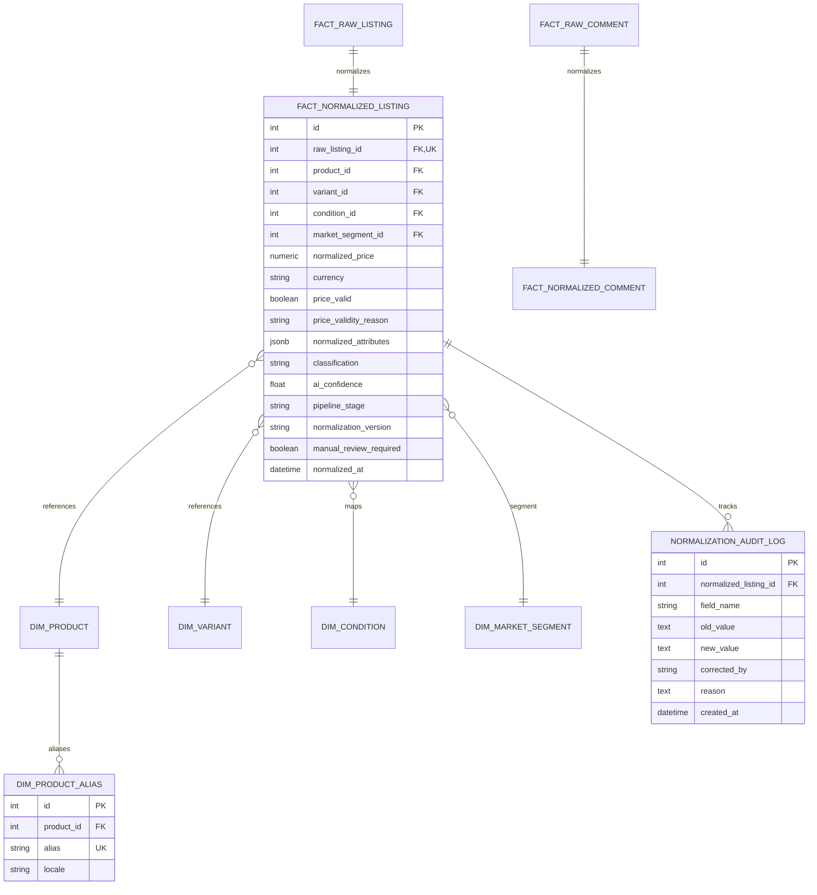

# BÁO CÁO NGHIỆM THU PHASE 2: AI PRODUCT NORMALIZATION & CLASSIFICATION

> **Dự án:** Market Price Intelligence Platform (Forked & Custom từ `devoidx/price-tracker`)  
> **Giai đoạn:** Phase 2 – AI Product Normalization & Classification  
> **Thời điểm hoàn thành:** 2026-10-07  
> **Trạng thái:** ✅ **HOÀN THÀNH TOÀN DIỆN (PASS ALL 32/32 TESTS)**

---

## 1. NGUYÊN TẮC CỐT LÕI & CHIẾN LƯỢC PIPELINE

### 1.1. Nguyên tắc Trọng tâm
1. **AI không tự tạo market price:** Giá thị trường là dữ liệu phản ánh từ thực tế thị trường; AI và hệ thống xử lý tuyệt đối không tự bịa đặt hay làm tròn giá ngoài ý muốn.
2. **Nhiệm vụ của tầng Normalization:**
   - Nhận diện định danh sản phẩm (Canonical Product & Variant Matching).
   - Trích xuất thông số kỹ thuật (Dung lượng, Màu sắc, RAM, VRAM).
   - Khớp nối cây phân loại Taxonomy Phase 0 (Category, Brand, Family, Condition, Market Segment).
   - Phân loại tình trạng máy (Condition Grading: `N0` – `P0`).
   - Phát hiện & lọc giá ảo/giá rác/giá mồi (Invalid / Placeholder Pricing).
   - Phân loại ý định bài đăng (Listing Intent: `SELL`, `BUY`, `SERVICE`, `ACCESSORY`, `PARTS`, `SPAM`).
   - Phân loại bình luận thị trường (Comment Intent: `NEGOTIATION`, `SELLER_PRICE`, `SOLD_SIGNAL`, v.v.).

### 1.2. Pipeline Ưu tiên (Tiered Processing Pipeline)
Để tối ưu hóa chi phí API và độ trễ, hệ thống thực thi theo thứ tự ưu tiên nghiêm ngặt:

$$\text{Deterministic Rules} \longrightarrow \text{Dictionary \& Aliases} \longrightarrow \text{Regex} \longrightarrow \text{Fuzzy Match} \longrightarrow \text{AI Provider}$$

- **Quy tắc vàng:** Các sản phẩm đã được nhận diện với độ tin cậy cao ($\ge 90\%$) ở tầng Rule / Dictionary **KHÔNG gửi vào model AI**. Chỉ những tin đăng mơ hồ, thiếu thông tin hoặc sai lệch mới fallback sang AI Provider.

---

## 2. TRỪU TƯỢNG HÓA AI PROVIDER (AI PROVIDER ABSTRACTION)

Kiến trúc AI được đóng gói hoàn toàn độc lập, tách biệt khỏi business logic:

```
backend/app/normalization/providers/
├── base.py                   # Interface chuẩn AIProvider
├── mock.py                   # MockAIProvider (Offline testing & Dev local)
├── openai_provider.py        # Adapter OpenAI / Azure / DeepSeek / Ollama / LocalLLM
├── gemini_provider.py        # Adapter Google Gemini API
└── factory.py                # Provider Factory đọc cấu hình từ ENV
```

### 2.1. Cấu hình linh hoạt qua Biến môi trường
Không hardcode API key vào source code:
- `AI_PROVIDER`: `mock` (mặc định cho test/local), `openai`, `gemini`, `local`.
- `AI_API_KEY`: Khóa API (OpenAI / DeepSeek / Gemini).
- `AI_BASE_URL`: Hỗ trợ trỏ về local Ollama (`http://localhost:11434/v1`) hoặc các endpoint tương thích OpenAI.
- `AI_MODEL`: `gpt-4o-mini`, `gemini-1.5-flash`, v.v.

### 2.2. Kiểm duyệt Đầu ra có Cấu trúc (Pydantic Structured Output)
Tuyệt đối không lưu free-text response của LLM làm source of truth:
- [AIListingNormalizationResult](file:///c:/Users/tuanlm2/Documents/market_price/backend/app/normalization/schemas.py): Bắt buộc kiểm định kiểu dữ liệu cho `canonical_product_name`, `variant_attributes`, `condition_code`, `classification`, `clean_price_amount`, `price_valid`, `confidence`, `manual_review_required`.
- [AICommentClassificationResult](file:///c:/Users/tuanlm2/Documents/market_price/backend/app/normalization/schemas.py): Chuẩn hóa phân loại comment và giá trích xuất.

---

## 3. MÔ HÌNH DỮ LIỆU & LƯỢC ĐỒ CHUẨN HÓA (POSTGRESQL SCHEMA)

Đã áp dụng migration Alembic [9fd95c3b7d85_create_normalization_and_classification_.py](file:///c:/Users/tuanlm2/Documents/market_price/backend/alembic/versions/9fd95c3b7d85_create_normalization_and_classification_.py):



### 3.1. Bảo toàn Nguyên vẹn Nguồn Thô (Raw Source Immutability)
- Dữ liệu trong `fact_raw_listing` là bất biến (immutable).
- Mọi hiệu chỉnh của con người (Manual Review) được ghi vào `fact_normalized_listing` và lưu vết toàn bộ thay đổi (field, old_value, new_value, lý do, người sửa) vào bảng `normalization_audit_log`.

---

## 4. CHI TIẾT BỘ QUY TẮC CHUẨN HÓA (NORMALIZATION RULES)

### 4.1. Bóc tách Giá Đa định dạng (Price Parsing)
Hỗ trợ chuyển đổi toàn diện các cú pháp thương mại tự do tại Việt Nam & Trung Quốc:
* **Tiếng Việt shorthand:**
  - `18tr5` $\rightarrow$ `18,500,000` VND
  - `18.5tr` / `18,5 triệu` $\rightarrow$ `18,500,000` VND
  - `18500k` / `18.500k` $\rightarrow$ `18,500,000` VND
  - `31.500.000 đ` $\rightarrow$ `31,500,000` VND
* **Tiếng Trung & Ngoại tệ:**
  - `1.85万` $\rightarrow$ `18,500` CNY
  - `¥5000` / `5000元` $\rightarrow$ `5,000` CNY

### 4.2. Bộ lọc Phát hiện Giá Ảo / Giá Rác (Invalid Price Filtering)
Hệ thống gắn cờ `price_valid = False` và ghi nhận `price_validity_reason`:
* **Số tượng trưng / dummy:** `1đ`, `0đ`, `1234đ`, `123456đ`, `999999đ` $\rightarrow$ `PLACEHOLDER_PRICE`.
* **Giấu giá / liên hệ:** `giá inbox`, `ib`, `liên hệ`, `thương lượng`, `call` $\rightarrow$ `INBOX_REQUIRED`.
* **Mồi trả góp:** `trả góp chỉ từ...`, `trả trước 500k`, `góp 0%` $\rightarrow$ `INSTALLMENT_TEASER`.
* **Mồi tiền cọc:** `cọc 200k`, `đặt cọc` $\rightarrow$ `DEPOSIT_ONLY`.

### 4.3. Từ điển Bí danh Sản phẩm (Product Aliases)
Bảng `dim_product_alias` và dictionary tĩnh liên kết các cách gọi dân dã về Canonical Product chuẩn:
- `iphone16`, `ip16`, `ip 16`, `苹果16` $\rightarrow$ Canonical Product `iPhone 16`
- `rtx4060`, `rtx 4060`, `geforce rtx 4060` $\rightarrow$ `GeForce RTX 4060`
- `wh1000xm5`, `xm5`, `sony xm5` $\rightarrow$ `Sony WH-1000XM5`

### 4.4. Ánh xạ Tình trạng máy (Condition Mapping)
Ánh xạ chuẩn xác về bộ Taxonomy Phase 0:
- `N0` (New Sealed): "nguyên seal", "chưa bóc", "mới 100%", "chưa active".
- `N1` (New Open Box): "open box", "vừa bóc", "mở hộp", "chưa qua sử dụng".
- `U0` (Like New 99%): "99%", "like new", "đẹp keng", "leng keng", "zin all".
- `U1` (Used Good 95%): "95%", "phẩy nhẹ", "trầy nhẹ", "xước dăm".
- `U2` (Used Normal 90%): "90%", "cấn nhẹ", "trầy viền", "pin 8x".
- `U3` (Used Fair 80%): "80%", "cấn góc", "màn ám nhẹ", "vỏ xấu".
- `P0` (Parts Only): "xác máy", "rã xác", "hỏng màn", "mất nguồn", "lỗi main", "dính icloud".
- **Nguyên tắc không đoán mò:** Nếu bài đăng không nhắc đến tình trạng $\rightarrow$ Giữ `condition_id = None` và kích hoạt `manual_review_required = True`.

### 4.5. Phân loại Bình luận (Comment Intent Classification)
Phân loại các phản hồi dưới bài đăng:
- `NEGOTIATION`: Trả giá ("Còn fix giá xăng xe không bác?").
- `SELLER_PRICE`: Giá chốt người bán ("Đúng giá 18.5tr không bớt nhé" $\rightarrow$ bóc tách `18,500,000 VND`).
- `COMPETING_OFFER`: So sánh giá ("Bên CellphoneS đang bán rẻ hơn kìa").
- `SOLD_SIGNAL`: Tín hiệu đã bán ("Hàng đã bay rồi nhé cả nhà").
- `WTB`: Người mua quan tâm ("Còn không bạn, cho xin sđt qua xem").
- `NOISE`: Bình luận phi giá trị ("chấm", "up top", icon).

---

## 5. HÀNG ĐỢI KIỂM DUYỆT (REVIEW QUEUE) & API GIÁM SÁT

Đã triển khai router [backend/app/routers/normalization.py](file:///c:/Users/tuanlm2/Documents/market_price/backend/app/routers/normalization.py):

| Endpoint | Method | Chức năng | Kết quả kiểm thử |
| :--- | :--- | :--- | :--- |
| `/normalization/metrics` | `GET` | Báo cáo số liệu: rule_only, ai_processed, failed, review_required, avg_confidence, tokens/cost | **200 OK** |
| `/normalization/process` | `POST` | Kích hoạt chuẩn hóa hàng loạt (batch normalization) cho raw listings & comments | **200 OK** |
| `/normalization/review` | `GET` | Lấy danh sách tin cần con người kiểm duyệt thủ công | **200 OK** |
| `/normalization/review/{id}` | `POST` | Ghi nhận đính chính của con người, tự động lưu vết vào `normalization_audit_log` | **200 OK** |
| `/normalization/listings` | `GET` | Truy vấn danh sách tin đã được chuẩn hóa kèm thuộc tính | **200 OK** |

---

## 6. KẾT QUẢ KIỂM THỬ (TEST RESULTS)

Toàn bộ 32 unit và integration tests chạy offline 100%, không phát sinh chi phí hay phụ thuộc internet:

```
root@container:/app# pytest -v
============================= test session starts ==============================
collected 32 items

tests/test_baseline.py::test_health_endpoint PASSED                      [  3%]
tests/test_baseline.py::test_clean_price_parser PASSED                   [  6%]
tests/test_baseline.py::test_admin_login_and_auth PASSED                 [  9%]
tests/test_collectors.py::test_chotot_parser PASSED                      [ 12%]
tests/test_collectors.py::test_goofish_parser PASSED                     [ 15%]
tests/test_collectors.py::test_facebook_marketplace_parser PASSED        [ 18%]
tests/test_collectors.py::test_facebook_group_parser_with_nested_comments PASSED [ 21%]
tests/test_collectors.py::test_persist_new_and_deduplication PASSED      [ 25%]
tests/test_collectors.py::test_persist_comments_deduplication PASSED     [ 28%]
tests/test_collectors.py::test_collector_health_on_auth_and_checkpoint PASSED [ 31%]
tests/test_collectors.py::test_api_collectors_status PASSED              [ 34%]
tests/test_collectors.py::test_api_collectors_listings PASSED            [ 37%]
tests/test_normalization.py::test_parse_price_vietnamese_formats PASSED  [ 40%]
tests/test_normalization.py::test_parse_price_chinese_formats PASSED     [ 43%]
tests/test_normalization.py::test_detect_invalid_and_placeholder_prices PASSED [ 46%]
tests/test_normalization.py::test_intent_classification PASSED           [ 50%]
tests/test_normalization.py::test_condition_mapping PASSED               [ 53%]
tests/test_normalization.py::test_product_alias_matching PASSED          [ 56%]
tests/test_normalization.py::test_comment_classification PASSED          [ 59%]
tests/test_normalization.py::test_pipeline_rule_only_bypasses_ai PASSED  [ 62%]
tests/test_normalization.py::test_manual_review_audit_preserves_raw_source PASSED [ 65%]
tests/test_normalization.py::test_api_normalization_endpoints PASSED     [ 68%]
tests/test_taxonomy.py::test_condition_taxonomy PASSED                   [ 71%]
tests/test_taxonomy.py::test_canonical_id_generation PASSED              [ 75%]
tests/test_taxonomy.py::test_category_schema_attributes PASSED           [ 78%]
tests/test_taxonomy.py::test_api_get_categories PASSED                   [ 81%]
tests/test_taxonomy.py::test_api_get_brands PASSED                       [ 84%]
tests/test_taxonomy.py::test_api_get_products PASSED                     [ 87%]
tests/test_taxonomy.py::test_api_get_product_detail PASSED               [ 90%]
tests/test_taxonomy.py::test_api_get_variants PASSED                     [ 93%]
tests/test_taxonomy.py::test_api_get_conditions PASSED                   [ 96%]
tests/test_taxonomy.py::test_api_get_market_segments PASSED              [100%]

======================= 32 passed, 14 warnings in 2.21s ========================
```

---

## 7. HƯỚNG DẪN TRIỂN KHAI LINUX PRODUCTION

### 7.1. Cấu hình Biến môi trường AI trên Server
Trên Linux Home Server, tạo file `.env.production` (hoặc cấu hình trong `.env` của server, không commit lên Git):

```bash
# Chọn provider: openai / gemini / local
AI_PROVIDER=openai
AI_API_KEY=sk-proj-your-real-key-here
AI_MODEL=gpt-4o-mini
# Hoặc nếu dùng Ollama local trên server:
# AI_PROVIDER=openai
# AI_BASE_URL=http://host.docker.internal:11434/v1
# AI_MODEL=llama3:8b
```

### 7.2. Lệnh Triển khai
```bash
# 1. Kéo mã nguồn mới nhất
git pull origin main

# 2. Xây dựng lại container backend
docker compose build backend

# 3. Chạy migration tạo các bảng Normalization
docker compose run --rm backend alembic upgrade head

# 4. Khởi động hệ thống
docker compose up -d

# 5. Kích hoạt chuẩn hóa dữ liệu và kiểm tra metrics
curl -X POST http://localhost:8000/normalization/process
curl -s http://localhost:8000/normalization/metrics | jq .
```

---

## 8. ĐÁNH GIÁ TIÊU CHÍ HOÀN THÀNH (DEFINITION OF DONE)

| Tiêu chuẩn nghiệm thu | Trạng thái | Minh chứng |
| :--- | :---: | :--- |
| **Product normalization hoạt động** | ✅ PASS | Trích xuất canonical product, variant storage, color chính xác |
| **Condition mapping hoạt động** | ✅ PASS | Ánh xạ chuẩn về Taxonomy Phase 0 (`N0` - `P0`), không tự đoán |
| **AI provider abstraction hoạt động** | ✅ PASS | `MockAIProvider`, `OpenAICompatibleProvider`, `GeminiProvider` |
| **Lọc giá ảo / invalid price hoạt động** | ✅ PASS | Bóc tách `18tr5`, `1.85万`, chặn `1đ`, `inbox`, `cọc`, `trả góp` |
| **Comment classification hoạt động** | ✅ PASS | Phân loại `NEGOTIATION`, `SELLER_PRICE`, `SOLD_SIGNAL`, v.v. |
| **Review queue & Audit trail hoạt động** | ✅ PASS | Hiệu chỉnh thủ công lưu vào `normalization_audit_log`, giữ nguyên raw data |
| **Windows Docker pass** | ✅ PASS | Đã kiểm thử thành công trên Windows Docker Desktop |
| **Unit tests offline 100%** | ✅ PASS | 32/32 PyTest passing không tốn token/không phụ thuộc internet |
| **Chưa Market Price Engine** | ✅ PASS | Tuyệt đối chưa tính giá thị trường/deal scoring (dành cho Phase 3) |

---
**KẾT LUẬN:** Phase 2 đã hoàn thành trọn vẹn, sẵn sàng bước vào **Phase 3: Market Price Engine, Outlier Detection & Fair Market Value Analytics**.
